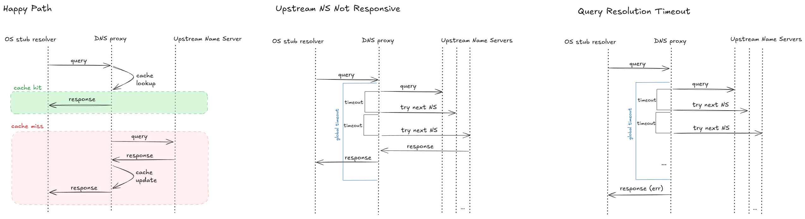

# DNS Server

This is work in progress. My goal is to create a simple DNS server that would act as:

1. a local DNS resolver for queries made by devices in my home network. In a way, this will be a forwarding server with a local cache and firewall capabilities. In long term, it will replace my router's built-in DNS server.
2. an authoritative DNS server for my own domain zone(s) under `pianykh.xyz`

## DNS Proxy

## Inspiration and Resources

- [Computer Networking: A Top-Down Approach](https://gaia.cs.umass.edu/kurose_ross/online_lectures.htm) by Kurose and Ross
- [RFC 1034](https://tools.ietf.org/html/rfc1034) and [RFC 1035](https://tools.ietf.org/html/rfc1035)
